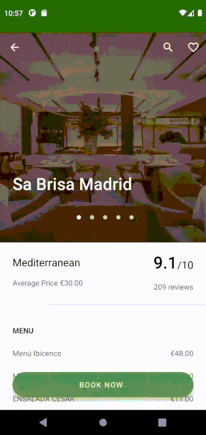

# The Fork Lite

Android application that displays a detail of a certain restaurant, using the The Fork API.

Architecture
------------
It's based on Clean Architecture. Using a MVVM, Use Cases and Repositories.

Libraries included
-----------------

- Kotlin
- Architecture Components
- Kotlin Coroutines/Flow
- Hilt
- Retrofit and OkHttp
- Data Binding
- Constraint Layouts
- Navigation Component
- Glide
- JUnit
- Truth
- Mockito
- Espresso
- Turbine

CI
--
There's already a workflow available for downloading the last stable build at https://github.com/feragusper/TheForkLite/actions

Demo
----

Getting Started
---------------

> :warning: **This project won't compile unless an API_KEY value is provided through local.properties or through env vars**

In order to build it locally, add `api.key=\"YOUR_THE_FORK_API_KEY\"` to your local.properties

Since this uses gradle 7, it requires java 11 to run.

- Use `./gradlew assemble` to build it, or run it in Android Studio.
- Use `./gradlew connectedAndroidTest` to run the tests on a connected emulator or device.
- Use `./gradlew test` to run the unit test on your local host.

Support
-------
If you've found an error in this project, please file an issue: https://github.com/feragusper/TheForkLite/issues

Patches are encouraged, and may be submitted by forking this project and submitting a pull request through GitHub.

Contribute
----------
Pull requests are welcome.

1. Fork it!
2. Create your feature branch: `git checkout -b my-new-feature`
3. Commit your changes: `git commit -am 'Add some feature'`
4. Push to the branch: `git push origin my-new-feature`
5. Submit a pull request :D
